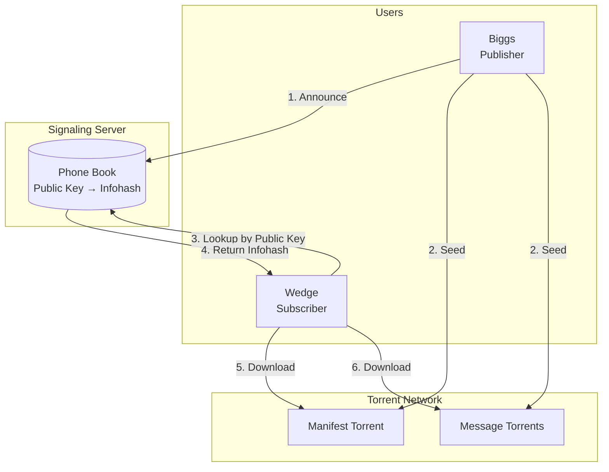
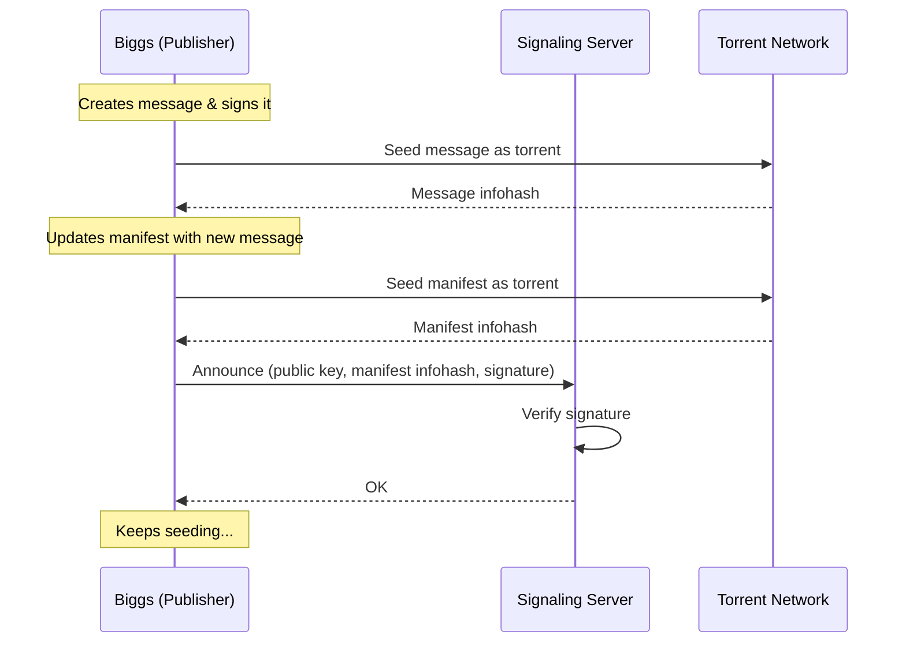
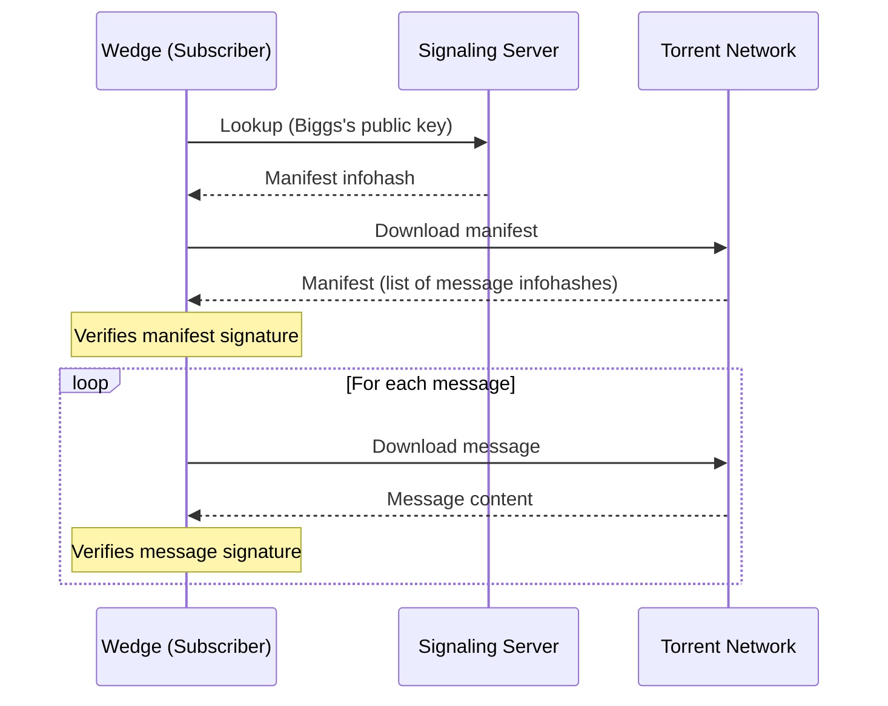
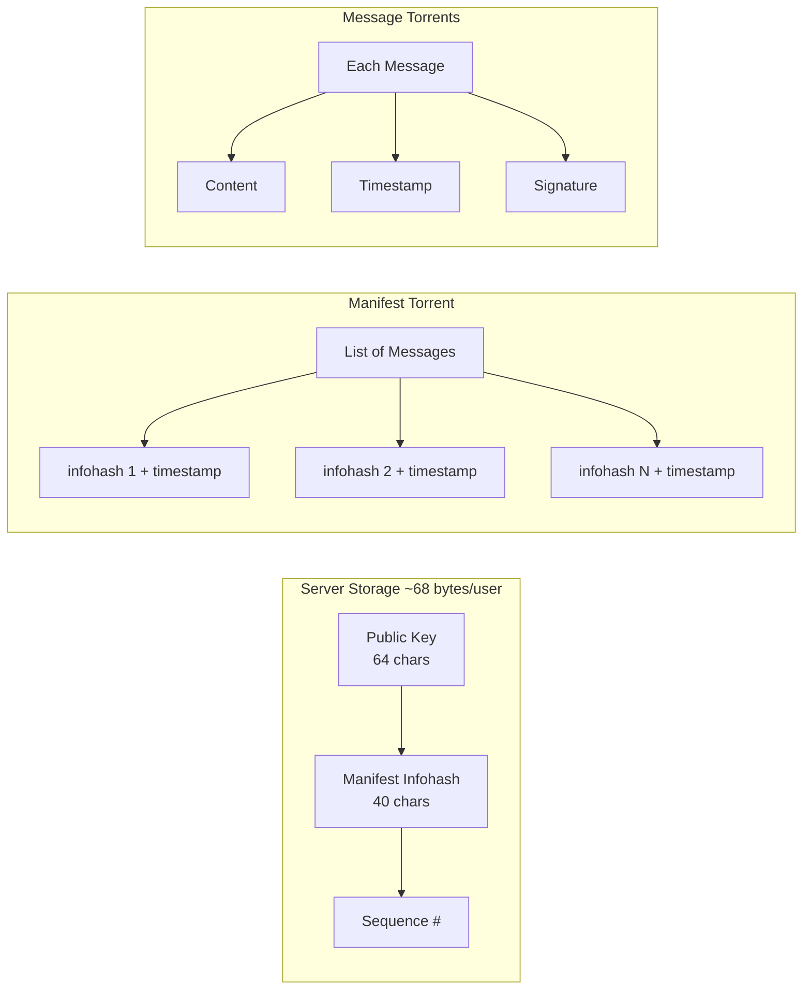

# Torrent Messaging

A simple proof of concept for sending messages using torrents. Share only your public key - others can find and download all your messages.

## How It Works



### Message Sharing Flow



### Message Finding Flow



### Data Structure



## Key Points

| Component | Role | Data Stored |
|-----------|------|-------------|
| **Signaling Server** | Phone book | Public key → latest manifest infohash |
| **Torrent Network** | File transfer | Actual messages (decentralized) |
| **Publisher** | Seeds torrents | Must stay online to serve files |
| **Subscriber** | Downloads | Only needs the public key |

The server is lightweight (~68 bytes per user) - it just points to where the data is. The actual messages flow peer-to-peer via torrents.

## Quick Start

### 1. Start the signaling server

```bash
node server.js
# Or on a custom port:
PORT=3001 node server.js
```

### 2. Generate your keys (only once)

```bash
node generate-keys.js
```

Output: `Public Key: 3094be6ffec0539f21b92671cc6e6d2a6920d1b7823e34b070b9a42e61a4bd35`

### 3. Share messages

```bash
SERVER_URL=http://localhost:3001 node share-message.js "Your message"
```

Keep this process running to seed the torrents.

### 4. Find messages by public key

```bash
SERVER_URL=http://localhost:3001 node find-messages.js <public-key>
```

### 5. Watch for new messages

```bash
SERVER_URL=http://localhost:3001 node find-messages.js <public-key> --watch --interval=60
```

## Environment Variables

| Variable | Default | Description |
|----------|---------|-------------|
| `SERVER_URL` | `http://localhost:3000` | Signaling server URL |
| `PORT` | `3000` | Server listening port |

## Server Capacity

For 1 million users:
- Storage: ~65-200 MB
- RAM: Can fit entire DB in memory
- CPU: Minimal (simple key-value lookups)

A $5/month VPS or even a Raspberry Pi can handle this easily.
